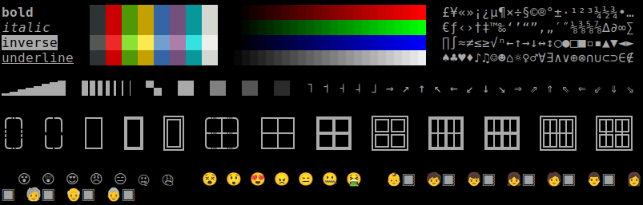
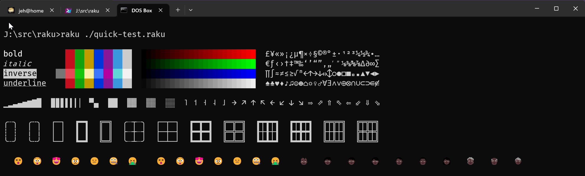
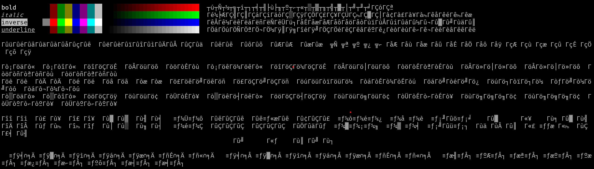
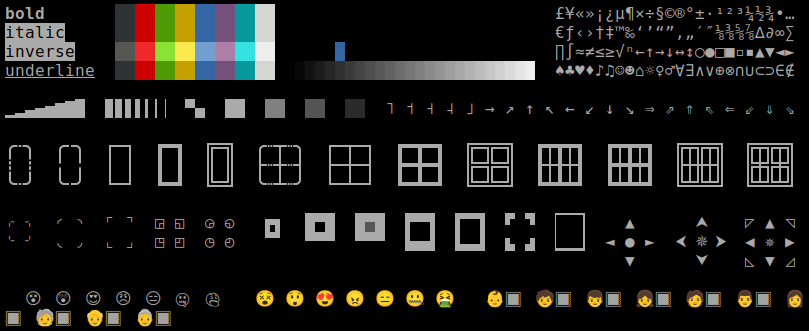
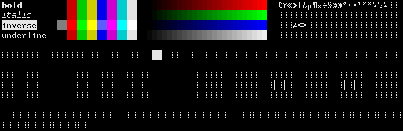
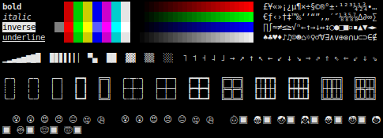
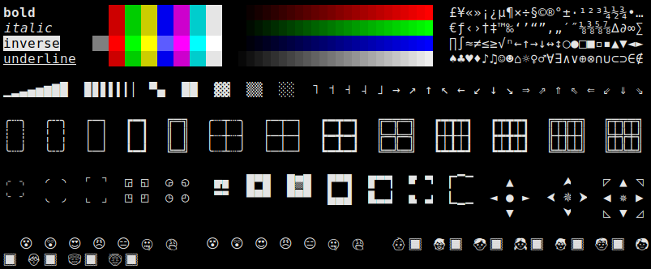

[](https://github.com/japhb/Terminal-Tests/actions)

NAME
====

Terminal::Tests - Terminal emulator and font quality and correctness tests

SYNOPSIS
========

```shell
$ terminal-quick-test [--ruler]
# ... single-page test output ...

$ terminal-test
# ... multi-page survey-style test ...
```

DESCRIPTION
===========

Terminal::Tests is a collection of quality and correctness tests for terminal emulators, terminal multiplexers, Unicode configurations, and monospace fonts.

The simple `terminal-quick-test` program displays a simple test pattern that should fit in a default 80x24 terminal window, and will catch some of the most common terminal configuration problems. For a more nuanced test, try the full `terminal-test` program, which shows numerous test patterns and describes what you should expect to see in each.

Quick Test Pattern
------------------

To display the quick test program, simply run `terminal-quick-test`; you can add the `--ruler` option if you'd like to also display a screen width ruler to help detect misalignment. *Correct* output should be no more than 79 columns on any line, so you've likely run into a terminal bug if the displayed test pattern is wider than that.

At the time of writing, I've not yet seen any terminals show a perfect test pattern; the best results so far get everything except the emoji row correct. For reference, here's what the pattern looks like on a default `gnome-terminal` in Ubuntu 22.04 LTS or Linux Mint 21.x (based on that same Ubuntu LTS release):



The rightmost block of emoji should have skin tones applied, rather than shown in fallback mode as a tone swatch next to a yellow emoji, causing the line to overflow. Windows Terminal in Windows 10 similarly gets most of the pattern correct, but again fails on the emoji row:



Here it applies skin tones to the rightmost set, but still leaves extra room where the tone swatch *would* be, thus once again causing the line to wrap -- and this time also failing on the leftmost set of emoji faces, which should display in text outline mode as seen in the screenshot for `gnome-terminal`.

However, Windows Terminal will only do that well under Windows 10 if "beta" UTF-8 support is turned on (see separate [Windows 10](#Windows 10) section below). Without that, the test pattern will fall apart:



Some failures are more subtle, affecting only one feature. Here's an example of the pattern as seen inside of GNU Screen in a `gnome-terminal`:



The degradation here is that Gnu Screen supports 4-bit and 8-bit ANSI color, but not 24-bit ANSI color, so the red/green/blue bars are missing.

Finally, some problems are merely configuration or option issues. Here's xterm in its default configuration on my system, using the low-res (but at least Unicode-capable) **bitmap** "fixed" font, launched with just `xterm`:


Many of the symbols are nearly unreadable, and emoji aren't supported at all. Even worse, specifying a larger bitmap font size defaults to using the *non-Unicode* version of the font, here launched with `xterm -fn 10x20`:



Using a scalable font will work better, even at the default small size, but emoji are still completely unsupported; here I've just told `xterm` to use the default system monospace scalable font using `xterm -fa mono`:



Scaling this up works better unsurprisingly (using `xterm -fa mono -fs 12`):



Full Terminal Test
------------------

The `terminal-test` program includes a far more complete set of test patterns across a range of categories, including descriptions of what you should expect to see in each pattern, as well as common artifacts that you should ideally *not* see. You can rate the display of each pattern on a simple scale, and the program will summarize the results in text or JSON (with the `--json` option) after you have rated the last test pattern.

Terminal-Specific Tweaks
------------------------

### Windows 10

By default Windows Terminal under Windows 10 supports only UTF-16, an old Unicode encoding that has otherwise been replaced by the UTF-8 encoding. To fix this, you'll need to follow the instructions in the [Enable UTF-8 in Windows Terminal](https://gist.github.com/sapeurfaire/91fe247cd9523971b8fab72d50df6c2a) gist, kindly provided by `sapeurfaire`.

AUTHOR
======

Geoffrey Broadwell <gjb@sonic.net>

COPYRIGHT AND LICENSE
=====================

Copyright © 2022-2023 Geoffrey Broadwell

This library is free software; you can redistribute it and/or modify it under the Artistic License 2.0.
